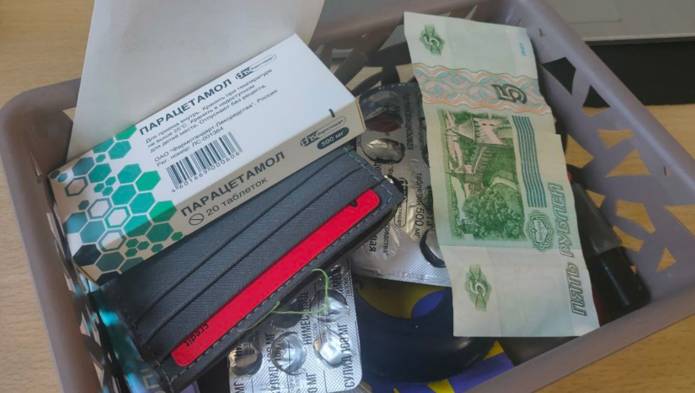
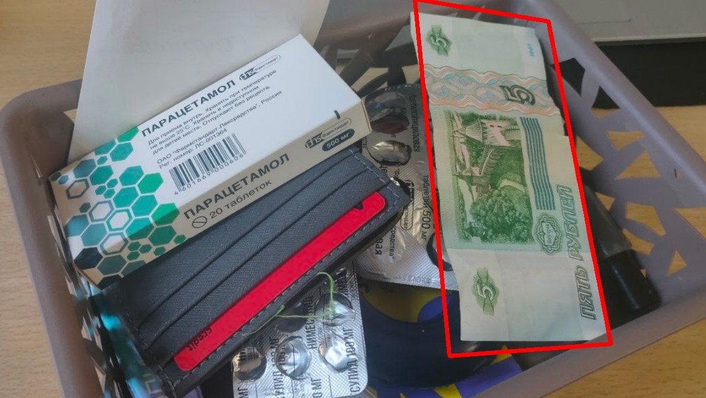
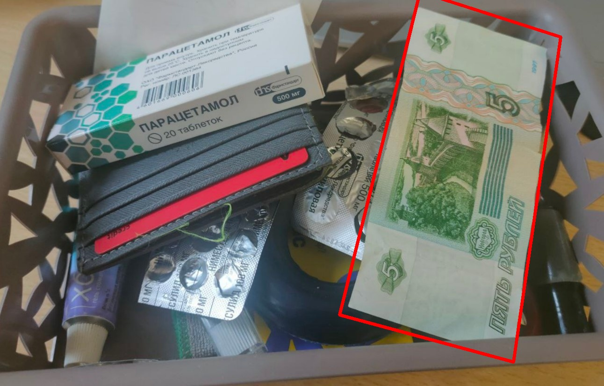

# Feature-Based Object Detection

## Table of Contents

* [Description](#description)
* [Project Structure](#project-structure)
* [Prerequisites](#prerequisites)
* [Installation](#installation)
* [Configuration](#configuration)
* [Usage](#usage)

## Description

A Python-based computer vision pipeline for object detection and localization using local feature matching.

The system detects objects in scenes by extracting local features from a reference image, matching them with features from a target scene, and estimating the object's location using homography transformation with RANSAC verification.

## Project Structure

```
.
├── config/
│   └── config.yaml          # Pipeline configuration
├── data/
│   ├── query/               # Reference object images
│   ├── scenes/              # Images for object detection
│   └── output/              # Detection results
├── src/
│   ├── detectors.py         # Feature detector implementations
│   ├── matchers.py          # Descriptor matching algorithms
│   ├── geometry.py          # Homography and geometric operations
│   ├── pipeline.py          # Main processing pipeline
│   └── config_parser.py     # Configuration management
└── main.py                  # Application entry point
```

## Prerequisites

* Python 3.10 or higher
* pip
* Optional: virtual environment (`venv`)

## Installation

Clone the repository:

```bash
git clone https://github.com/rysel0/Feature-Based-Object-Detection.git
cd Feature-Based-Object-Detection
```

Create a virtual environment and install dependencies:

```bash
python -m venv venv

# Linux/macOS
source venv/bin/activate

# Windows
venv\Scripts\activate

pip install -r requirements.txt
```

## Configuration

The pipeline parameters are separated from the source code and managed through `config/config.yaml`.

Configuration is validated automatically using Pydantic models.

Example:

```yaml
paths:
  query_dir: "data/query"
  scene_dir: "data/scenes"
  output_dir: "data/output"

detector:
  method: "sift"
  nfeatures: 1000

matcher:
  type: "bf"
  norm_type: "L2"
  ratio_threshold: 0.7

homography:
  ransac_threshold: 5.0
  min_matches: 10
```

## Usage

1. Add a reference object image to:

```
data/query/
```

2. Add scene images where the object should be detected:

```
data/scenes/
```

3. Run the pipeline:

```bash
python main.py
```

## Example Results

Reference object:


Detection results:

| Scene | Result |
|-------|--------|
|  |  |
|  |  |